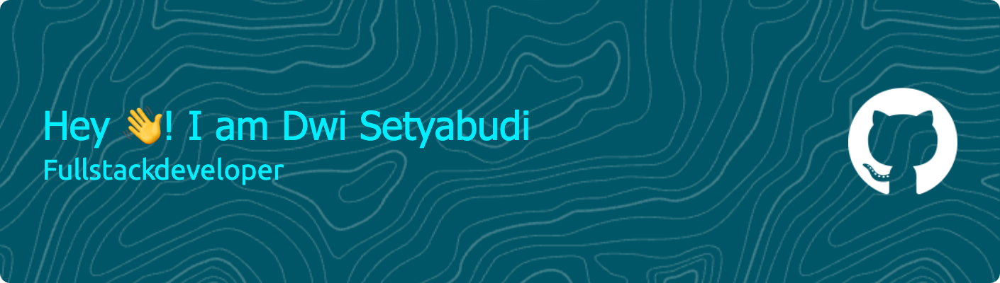

###

I have a deep interest in programming, especially in web development. 
I continue to develop my technical skills in building responsive, functional, and user-friendly interfaces, and broaden my understanding of backend technologies and best practices in modern software development.

With a high spirit of learning, I am committed to creating innovative digital solutions and providing the best user experience.

📍 Domiciled in Jakarta

🎓 Currently participating in the Koda Academy Bootcamp program

💡 Development focus: Frontend Development & Collaboration Skill

###

  
  

###

  
  
  
  
  
  
  
  
  
  
  
  
  
  
  
  
  

###

  
  
  
  

###

<picture>
  <source media="(prefers-color-scheme: dark)" srcset="https://raw.githubusercontent.com/Dwaysetya/Dwaysetya/output/pacman-contribution-graph-dark.svg">
  <source media="(prefers-color-scheme: light)" srcset="https://raw.githubusercontent.com/Dwaysetya/Dwaysetya/output/pacman-contribution-graph.svg">
  
</picture>

###